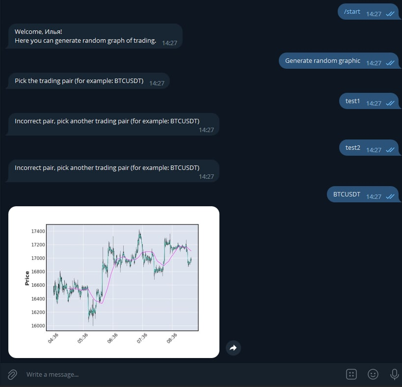

# Test telegram bot

To run this bot you must run this commands:

```shell
git clone https://github.com/Kitazuka/test-telegram-bot.git
python -m venv venv
venv\Scripts\activate (on Windows)
source venv/bin/activate (on macOS)
pip install -r requirements.txt
export TOKEN=(Your bot token)
python telegram_bot.py
```

You can use this test bot:

https://t.me/Paper_trade_random_bot

# Demo


